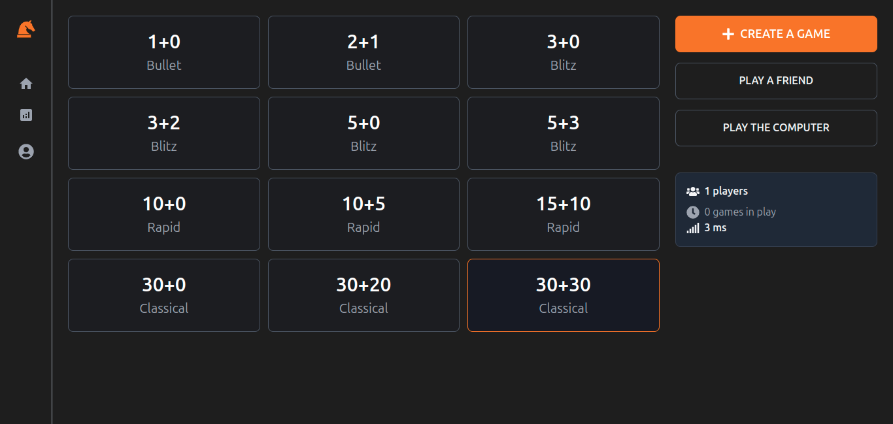
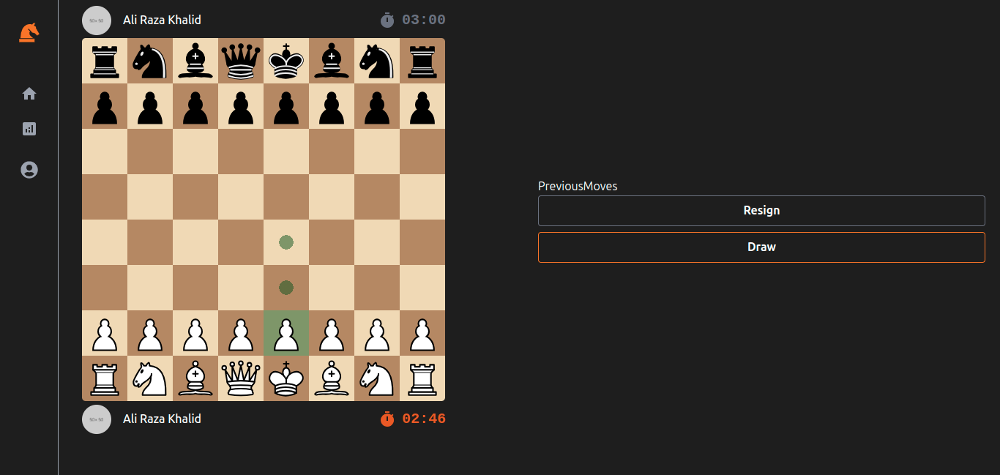

# Fishy Chess

A real-time online chess application built with the MERN stack and Socket.io.




## Features

- **Real-time Multiplayer:** Play chess with other users in real-time.
- **Matchmaking:** Join a queue to be automatically matched with another player.
- **Custom Games:** Create custom games to play with friends.
- **User Authentication:** Sign up and log in to track your stats.
- **Server Statistics:** View server-wide statistics, such as the number of online players and games in progress.

## Technologies Used

**Backend:**

- **Node.js:** JavaScript runtime environment.
- **Express.js:** Web framework for Node.js.
- **MongoDB:** NoSQL database for storing user data and game history.
- **Mongoose:** Object Data Modeling (ODM) library for MongoDB.
- **Socket.io:** Library for real-time, bidirectional and event-based communication.
- **JWT:** JSON Web Tokens for user authentication.

**Frontend:**

- **React:** JavaScript library for building user interfaces.
- **Vite:** Next-generation frontend tooling.
- **React Router:** Declarative routing for React.
- **Zustand:** Small, fast and scalable bearbones state-management solution.
- **Tailwind CSS:** A utility-first CSS framework.
- **Socket.io Client:** Client-side library for Socket.io.

## Getting Started

These instructions will get you a copy of the project up and running on your local machine for development and testing purposes.

### Prerequisites

- Node.js (v14 or later)
- npm
- MongoDB

### Installation

1.  **Clone the repository:**

    ```bash
    git clone https://github.com/Razamindset/fishy.git
    cd fishy
    ```

2.  **Install dependencies:**

    Install both the server and client dependencies:

    ```bash
    npm install
    npm install --prefix web
    ```

3.  **Set up environment variables:**

    Create a `.env` file in the root directory and add the following:

    ```
    MONGODB_URL=your_mongodb_connection_string
    JWT_SECRET=your_jwt_secret
    PORT=3000
    ```

### Development

To run both the client and server in development mode with hot-reloading, use the following commands:

```bash
npm run dev:server
npm run dev:client
```

This will start the server on `http://localhost:3000` and the client on `http://localhost:5173`.

### Production

To build the client and run the production server, use the following commands:

```bash
npm run build
npm start
```

This will create a production build of the client and serve it from the server on `http://localhost:3000`.
